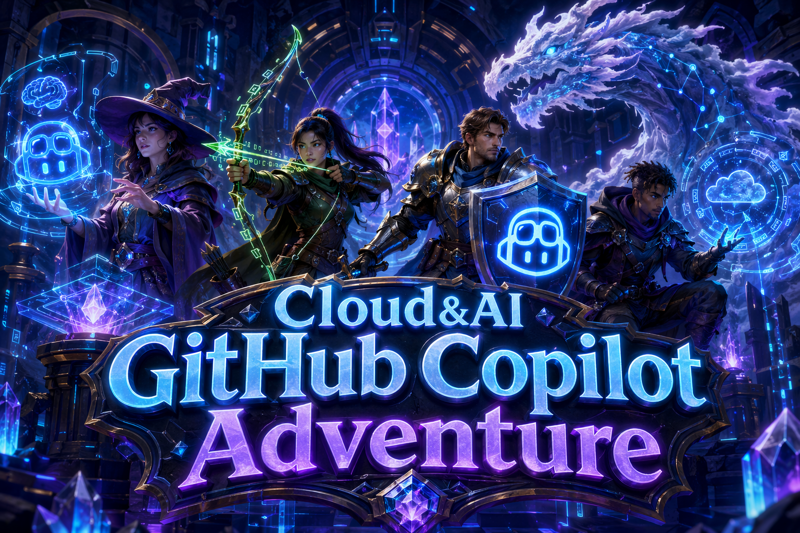

## GitHub Copilot Adventure C&AI

### Getting Started

Before picking an adventure, set up your working workspace:

1. Create a new empty folder on your machine and open it in VS Code
2. Inside that folder, create the following .github folder:

        your-workspace/

            └── .github/
        

3. This is where GitHub Copilot will create your solution files and where you will save your reusable .md files

You are now ready to follow the adventure below and start coding! Please keep in mind to start a new instance of GitHub Copilot Chat everytime you begin a new adventure!

---
### 1. Enter the Adventure Arena

*Experience autonomous AI agent development with comprehensive project creation*

- **[The Clockwork Town of Tempora](./Adventures/Agent/1-Beginner/The-Clockwork-Town-of-Tempora-Agent.md)** - In the mechanical town of Tempora, everything operates on clockwork and precise timing. At the heart of the town is the Grand Clock Tower, responsible for keeping time for all the town's activities. However, over the years, some smaller clocks in the town have started to drift away from the accurate time.
- **[The Magical Forest of Algora](./Adventures/Agent/1-Beginner/The-Magical-Forest-of-Algora-Agent.md)** - Deep within the enchanted Forest of Algora, two mystical creatures, the Lox and the Faelis, perform a sacred dance every millennium. This dance is not just for celebration but is a ritual to bring balance to the forest.
- **[The Command Center of Stellaris (Custom Agent Chat Mode)](./Adventures/Agent/1-Beginner/The-Command-Center-of-Stellaris-Agent.md)** - In the galaxy of Stellaris, the Galactic Command Center coordinates missions across star systems using expert AI commanders. A recent upgrade enables custom command protocols, letting commanders activate mission-specific modes with advanced tools and guidance for any challenge.
- **[The Celestial Alignment of Lumoria](./Adventures/Agent/2-Intermediate/The-Celestial-Alignment-of-Lumoria-Agent.md)** - In the vast expanse of the Galaxia Nebulae, a rare phenomenon is about to occur in the Lumoria star system. The planets, revolving around the Lumorian Sun, are aligning in a celestial dance that happens only once every few millennia. This alignment has a unique effect on how the light from the Lumorian Sun reaches each planet.
- **[The Legendary Duel of Stonevale](./Adventures/Agent/2-Intermediate/The-Legendary-Duel-of-Stonevale-Agent.md)** - In the mystical realm of Stonevale, two warriors, Rok and Papyra, are chosen for a duel that determines the fate of their tribes for the next century. The arena, known as Scissoria, is where each move carries weight and consequences.
- **[The Scrolls of Eldoria](./Adventures/Agent/2-Intermediate/The-Scrolls-of-Eldoria-Agent.md)** - In the enchanted land of Eldoria, ancient scrolls contain the secrets of the universe. These scrolls, however, were scattered and protected by the Elders using powerful spells. These spells concealed the secrets within the scrolls, adding layers of misleading information to deter prying eyes. Over time, these scrolls were digitized and stored in the Great Eldorian Library, accessible only through the Eldorian Web of Knowledge.
- **[The Gridlock Arena of Mythos](./Adventures/Agent/3-Advanced/The-Gridlock-Arena-of-Mythos-Agent.md)** - In the mystical land of Mythos, creatures from various realms come together to battle in the Gridlock Arena, a chess-like grid where strategy, power, and cunning are tested. Each creature has its unique move, power, and strategy.
- **[The Knowledge Cartographer (Agent + MCP)](./Adventures/Agent/3-Advanced/The-Knowledge-Cartographer-Agent-MCP.md)** - In the vast digital expanse of the Akashic Archives, ancient knowledge fragments are scattered across countless web domains. As a Knowledge Cartographer, you'll build a system that combines web scraping with intelligent knowledge organization using GitHub Copilot Agent Mode and MCP (Model Context Protocol) tools.
---
### 2. Start Coding

Read Your Copilot Adventure description, the high-Level tasks to perform, and the GitHub Copilot hints to help you write your code.

- Use [GitHub Copilot](https://docs.github.com/en/copilot/get-started/quickstart) to help you write the code for the adventure. You can use any language you'd like. Try learning a new language if you're up for the challenge (more on that below)!
- Leave any comments in your code to explain your thought process and show prompts that GitHub Copilot used to help you out.

## Next Steps: Learn a New Language or Create a UI for Your Adventure

Once you've completed your first adventure, try it again but this time use GitHub Copilot to complete the adventure using a language that's new to you. For example, if you normally write code in C#, use Copilot to help you solve the adventure using Python or another language you'd like to learn more about.

Try creating a UI for your adventure. Use pure HTML/CSS/JavaScript or a library/framework of your choosing. Let GitHub Copilot help you out with the UI code. If your UI requires images, consider using [Bing Image Creator](https://www.bing.com/create) or another AI image generation service.
